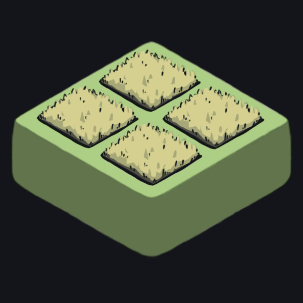

# Title
> Text blurb about what this is

 

## Table of Contents
- [Name of section](#link-to-section)
- [Name of section](#link-to-section)
- [Name of section](#link-to-section)
- [Name of section](#link-to-section)
- [Name of section](#link-to-section)

 

| Farm | Village | Hamlet |
|---|---|---|
|  |  |  |