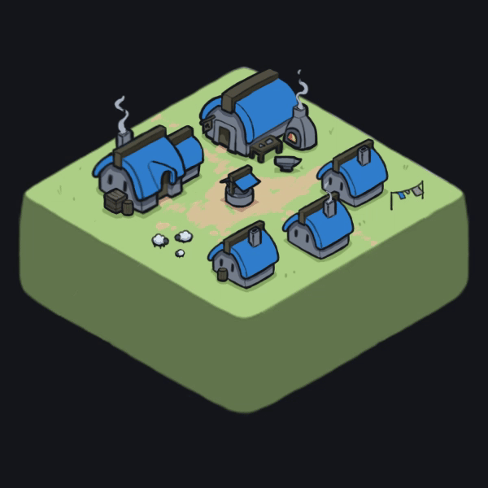
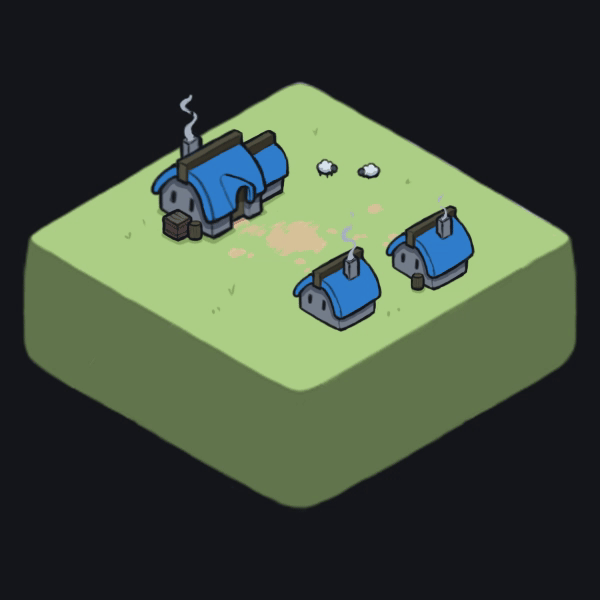
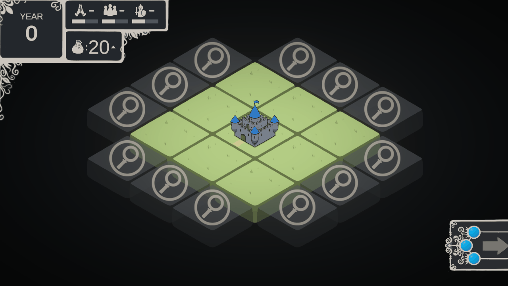
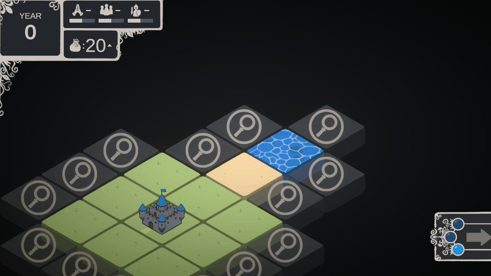

# Proof of Concept for a Turn Based City Builder
> Hello!  
> This is a Turn Based City Builder project that I worked on recently.    
> This project is a proof of concept This was an exploration of the different systems that go into creating a grid based, turn based, city builder game would require.    
> Check out the game if you want to! Otherwise this README is going to go through each system that was implemented for this project  

 

## Table of Contents
- [Exploration and Tile Generation](#Exploration-and-Tile-Generation)
- [Turn System](#Turn-System)
- [Build System](#Build-System)
- [Movement](#Movement)
- [Potential Routes for Further Design](#Potential-Routes-for-Further-Design)

 

| Farm | Village | Hamlet |
|---|---|---|
|  |  |  |

## Exploration and Tile Generation

> When the game is first launched the player is placed on a 3x3 grid of tiles.  
> The player can click on the search tiles around the edge of the grid in order to generate an additional tile on the grid.  
 

 

> In the backend, there is a modifiable ruleset about which tiles can be generated next to each tile. This allows a designer to change how the terrain generation feels with just a simple alteration to the tile ruleset. This also allows for interesting specialized generation depending on the tiles surrounding environment 
> For example if a user explores next to an ocean tile that tile can only become a water, beach, or grasslands tile.  

 

 

> When the search tile is touching two or more already explored tiles, the game instead chooses the intersection of the terrain types available of the surrounding tiles. This can cause a problem if there are no available terrain in the intersection of the terrains, so to avoid this, all terrains must have a grasslands terrain in their possible explore terrains.  
> This avoids the situation where the intersection between two different terrain types to be zero. 
 

## Turn System

> This project works on a turn based system. The system is relatively simple, the player is given three actions per turn. The player can perform two different types of actions. They can either explore and generate new tiles or they can build buildings on the previously generated tiles. When they have used all three actions they will not be able perform another action until after they end their turn. 
> They must perform all three actions in order to end their turn  
 

 
> When the player ends their turn the year in the top right updates as well as all four resources. Each resource has symbol next to it that informs the player whether that resource will increase, decrease, or stay the same.  
> Currently the top three resources do not have functionality however the bottom resource can stop a player from creating new buildings.

## Build System

> Each explored tile can have one building built on the tile. The buildings available for that tile depends on the tile's terrain. Each terrain type has a configurable list of buildings that they can build. Once a building has been built the player can no longer remove the building nor place a new building on that tile.  
>Each building cost a set amount of resources, when the player no longer has enough resources to build the building the button is greyed out. 
 

 

Buildings have configurable effects. All buildings can either immediately give any of the 4 types of resources, and/or give a continual amount of resources per turn. Buildings types can also have specific abilities unrelated to resources.   
 
For example the castle building that appears in the center square at the start of the game provides the player with 20 resources, it also generates 5 additional resources per turn. But it also has an additional effect where it removes itself from the list of available buildings. This means that one is built at the start of the game but the player cannot build a second one. 
> 
## Movement
> Player movement is implemented into the game and allows the player to scroll in any direction as well as zoom in and out a set distance. The zoom speed approaches the further it gets away from the the median distance, so the player cannot scroll infinitely out. 
 

 

## Potential Routes for Further Design

> There are multiple different routes that could be taken from this point in development.  
> The most immediately valuable additional change would be the creation of an event system that introduces conflict to the game. 
> For example, events could occur when the player advances to a new year. These events could force the player to make a decision between two choices that both have negative outcomes. A skilled player would make a decisions that they are better equipped to handle. As the years/turns increase, the difficulty and frequency of these event choices could increase as well until only the smartest player with the most optimal city survives.  
> These events could also modify the way the player plays. Decisions could remove or add different types of buildings that the player has access to, so they would have to change they way they play depending on the opportunities given to them.  
> An interesting example game to reference could be Reigns
   
> Another route that could be taken is to just add a large amount of content and terrain rules. Instead of the player fighting for survival they are attempting to find all possible combinations and buildings.  
> For example a Deep Forest terrain type could be added that can only be discovered if the search tile is surrounded by forest tiles. This new tile could have new building and interactions that work differently than the regular forest tile. Or a building that only unlocks if the player first builds other buildings. Such as a tavern only unlocks if the player has made the farm, mill, and brewery buildings beforehand.   
> In this case the fun of the game could be found just by exploring the combinations and trying to discover all of the different buildings in the game.  
> An interesting example game to reference could be Doodle God.  

## Conclusion

> This was a fun project to work on and thank you for reading through this whole write up. Although I am more interested in exploring new different mechanics and engines at the moment, I may come back to this in the future. 
> If you have any questions or want to reach out, shoot me an email. 
